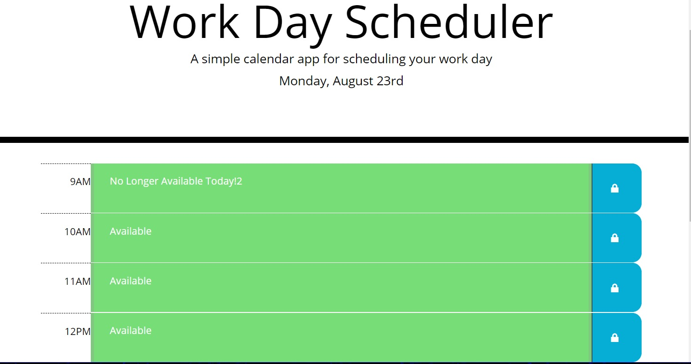

# Work Day Scheduler
Ever find yourself without a pen and paper to write down your schedule for the day?  No problem!  Pull this little guy up on your phone or computer and quickly plan you day!  It even highlights the hours that are no longer available, the current hour and all available future hours with different colors.

A link to the quiz can be found [here](https://jondagamkd.github.io/scheduler/).

This site was built using [The Visual Studio Code Editor](https://code.visualstudio.com/) and [GitHub Pages](https://pages.github.com/).

All projects within are the property of John T. Woodland.

